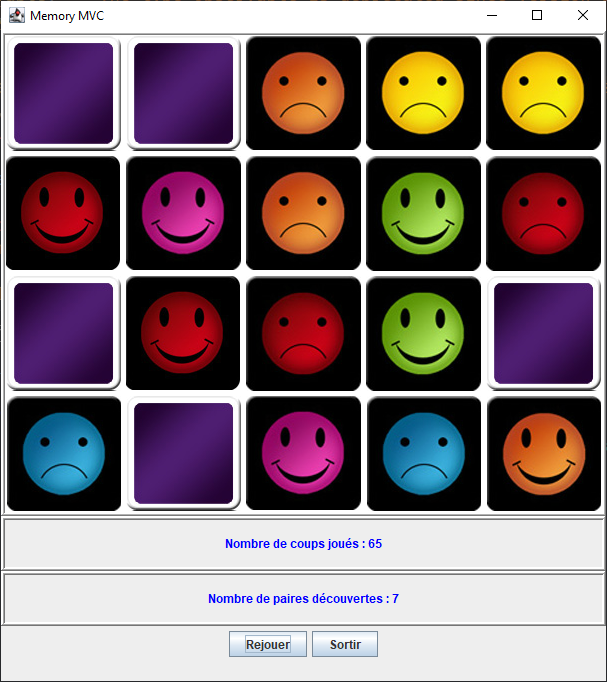

# Jeu de mémoire

>Auteur: Raphaël Roumat

Projet scolaire de DUT Informatique.

Bibliothèques d'UI:

- `Swing`

## Description:

Jeu de mémorisation des positions de pairs d'images. La disposition des images est aléatoire. Dans le cadre de ce projet scolaire un squelette de départ est fournie avec une fenêtre vide et le reste du jeu doit être ajouté. L'architecture du programme doit être du type modèle-vue-contrôleur.

## Résultat

